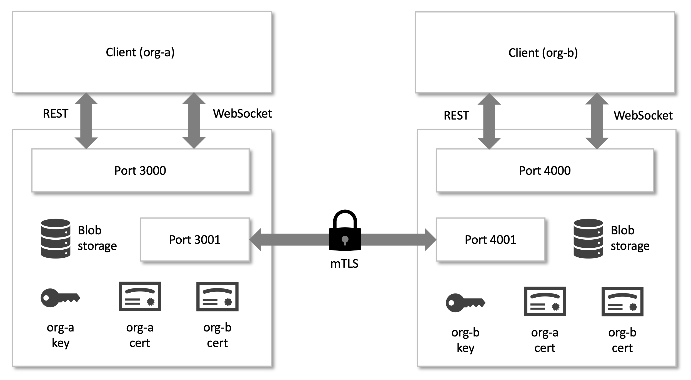

# Firefly MTLS Data Exchange

The following steps show how to setup Firefly MTLS Data Exchange for two organizations named `org-a` and `org-b` running on `localhost`.



`org-a` will use port `3000` for API and port `3001` for P2P. `org-b` will use port `4000` for API and port `4001` for P2P. Each organization will have its own private key and self-signed certificate.

## Setup org-a

#### Environment variables

Open a command line window and set the following environment variables, assigning an appropriate location to `DATA_DIRECTORY`. This is where configuration and certificate files will reside:
```
export DATA_DIRECTORY=/data-a
export LOG_LEVEL=info
```

#### Configuration file

Create `config.json` in the data directory and set its content to:
```
{
  "$schema": "../../src/schemas/config.json",
  "apiPort": 3000,
  "p2pPort": 3001,
  "apiKey": "xxxxx",
  "peers": [
    {
      "name": "org-b",
      "endpoint": "https://localhost:4001"
    }
  ]
}
```

Based on this configuration:
- Port 3000 will be used to access the API
- Port 3001 will be used for P2P communications
- The API key will be set to `xxxxx`
- There is one peer named `org-b` whose P2P endpoint is `https://localhost:4001`

#### Generate certificate

In the data directory, run the following command:
```
openssl req -new -x509 -nodes -days 365 -subj '/CN=localhost/O=org-a' -keyout key.pem -out cert.pem
```
This will generate files `key.pem` and `cert.pem`. Notice that the common name is `localhost` while the organization name is `org-a`.

## Setup org-b

#### Environment variables

Open a second command line window and set the following environment variables, assigning an appropriate location to `DATA_DIRECTORY`. This is where configuration and certificate files will reside:
```
export DATA_DIRECTORY=/data-b
export LOG_LEVEL=info
```

#### Configuration file

```
{
  "$schema": "../../src/schemas/config.json",
  "apiPort": 4000,
  "p2pPort": 4001,
  "apiKey": "yyyyy",
  "peers": [
    {
      "name": "org-b",
      "endpoint": "https://localhost:4001"
    }
  ]
}
```

Based on this configuration:
- Port 4000 will be used to access the API
- Port 4001 will be used for P2P communications
- The API key will be set to `yyyyy`
- There is one peer named `org-a` whose P2P endpoint is `https://localhost:3001`


#### Generate certificate

```
openssl req -new -x509 -nodes -days 365 -subj '/CN=localhost/O=org-b' -keyout key.pem -out cert.pem
```

This will generate files `key.pem` and `cert.pem`. Notice that the common name is `localhost` while the organization name is `org-b`.

## Copy certificates

- Copy `/org-a/cert.pem` to `/org-b/peer-certs/org-a.pem`.
- Copy `/org-b/cert.pem` to `/org-a/peer-certs/org-b.pem`.

This will make it possible for the organizations to establish MTLS communications with each other.

## Build and run the processes

- Run `npm run build`.
- In the command line window for `org-a` run `npm start`
- In the command line window for `org-b` run `npm start`

## Access the API Swagger

- Open a new web browser window and navigate to `http://localhost:3000`
- Open another web browser window and navigate to `http://localhost:4000`

## WebSocket Events


| Type            | Description                                                | Additional properties
|-----------------|------------------------------------------------------------|-----------------------
|blob-received    | Emitted to the recipient when a blob has been transferred  | sender, path, hash
|blob-delivered   | Emitted to the sender when a blob has been delivered       | recipient, path
|blob-failed      | Emitted to the sender when a blob could not be delivered   | recipient, path
|message-received | Emitted to the recipient when a message has been sent      | sender, message
|message-delivered| Emitted to the sender when a message has been delivered    | recipient, message
|message-failed   | Emitted to the sender when a message could not be delivered| recipient, message

- After receiving a websocket message, a commit must be sent in order to receive the next one:
  ```
  { "action": "commit" }
  ```
- Messages arrive in the same order they were sent
- Up to 1,000 messages will be queued

## Alternative setup using CA

Generate CA key and cert:
```
openssl req -new -x509 -nodes -days 365 -subj '/CN=blob-exchange-ca' -keyout ca-key.pem -out ca.crt
```

Generate `org-a` key:
```
openssl genrsa -out org-a.key 2048
```
Generate `org-a` CSR:
```
openssl req -new -key org-a.key -subj '/CN=localhost,O=org-a' -out org-a.csr
```
Create signed certificate using CSR, CA
```
openssl x509 -req -in org-a.csr -CA ca-cert.pem -CAkey ca-key.pem -CAcreateserial -days 365 -out org-a.crt
```
Generate `org-b` key:
```
openssl genrsa -out org-b.key 2048
```
Generate `org-b` CSR:
```
openssl req -new -key org-b.key -subj '/CN=localhost,O=org-b' -out org-b.csr
```
Create signed certificate using CSR, CA
```
openssl x509 -req -in org-b.csr -CA ca-cert.pem -CAkey ca-key.pem -CAcreateserial -days 365 -out org-b.crt
```
